# 使用idea2021创建一个Java  Web工程

1.先按照普通创建java工程的方法创建。

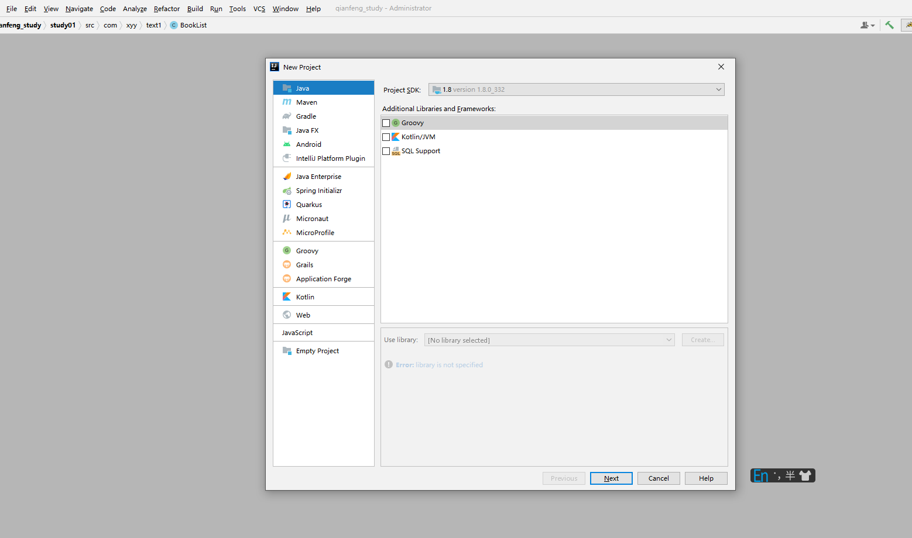

2.右击工程名称，找到Add Framework Support...,并点击。

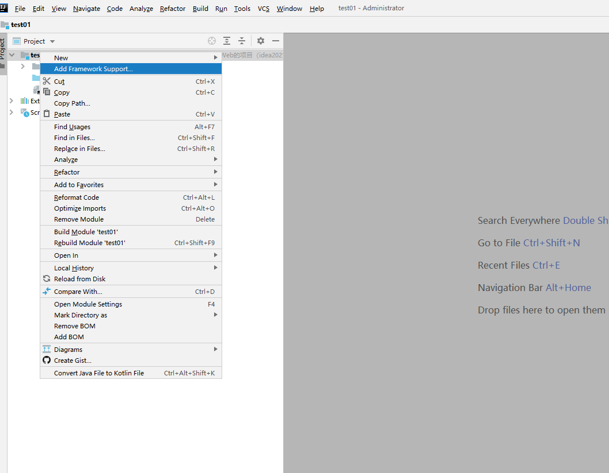

3.按照下图进行设置。

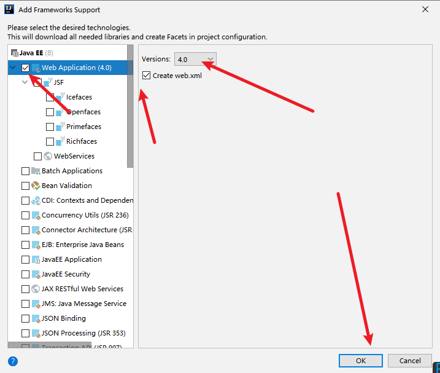

如下图所示：

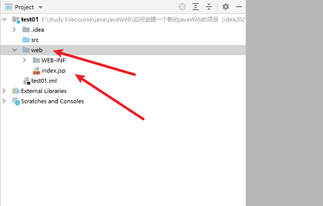

4.分别在工程目录下创建recourse文件夹和Web目录下创建classes和lib文件夹

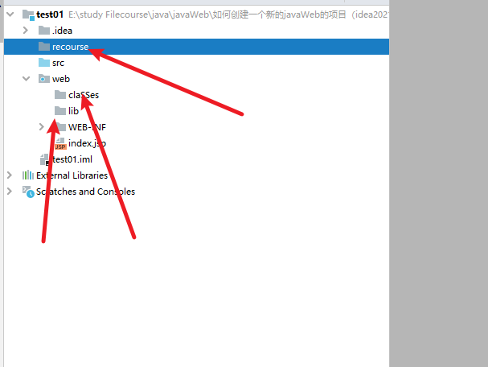

5.File找到Project Structure

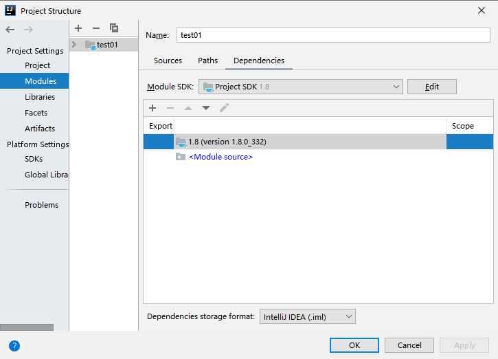

6.选中recourse将其设置为sources文件

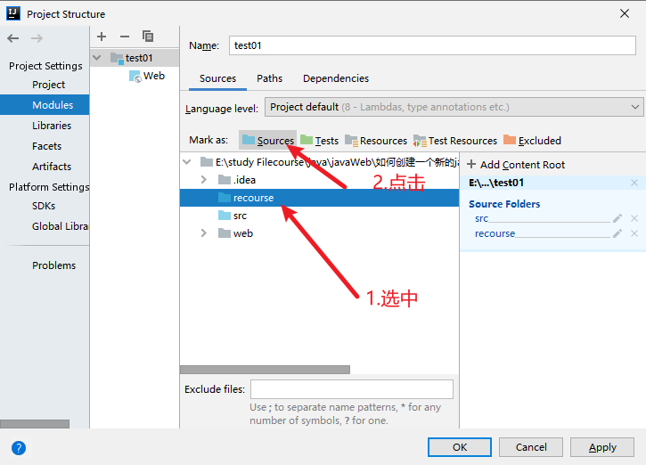

7.

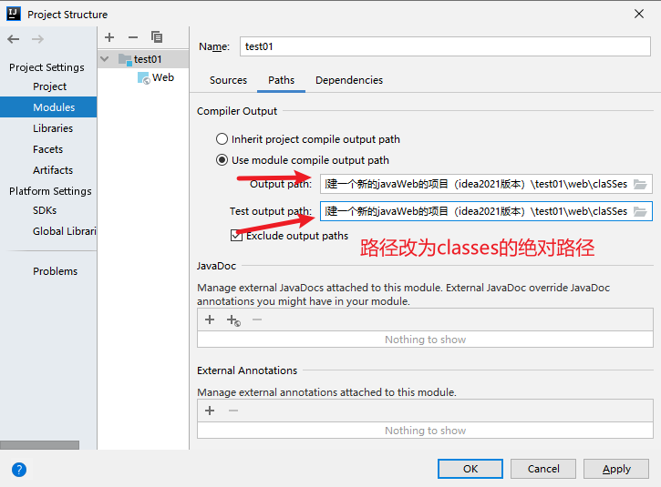

8.点击+x选中JARS... 将其布置在lib路径下。

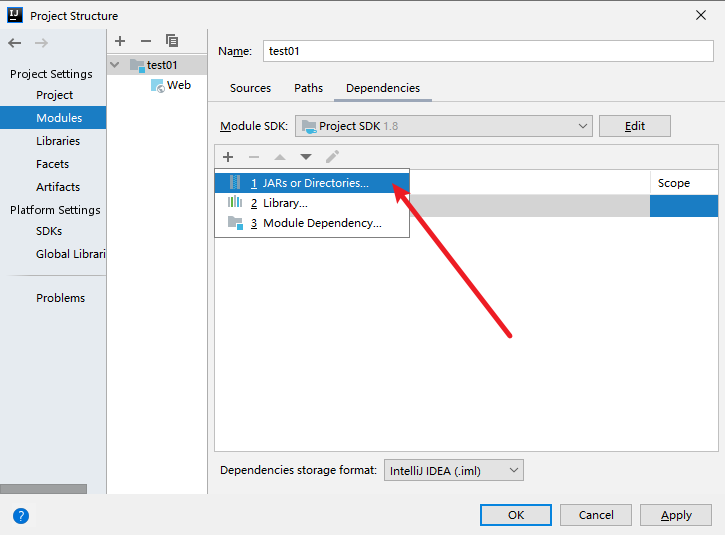

选中jar Directory 点击ok

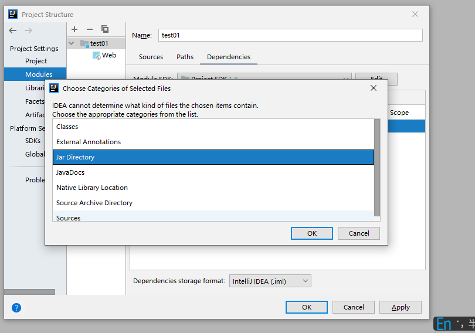

9.配置TomCat

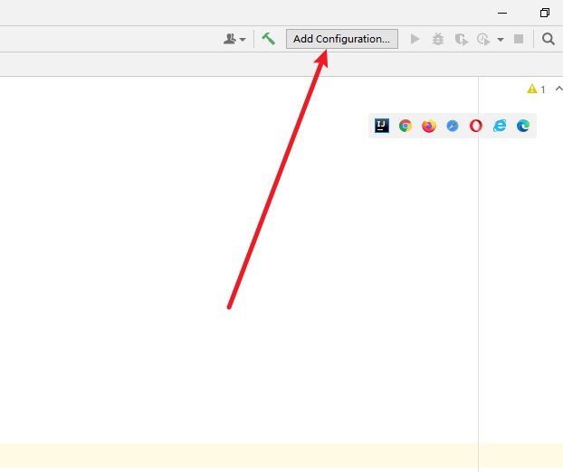

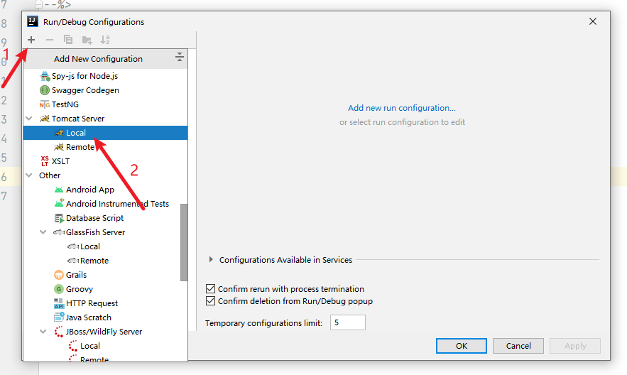

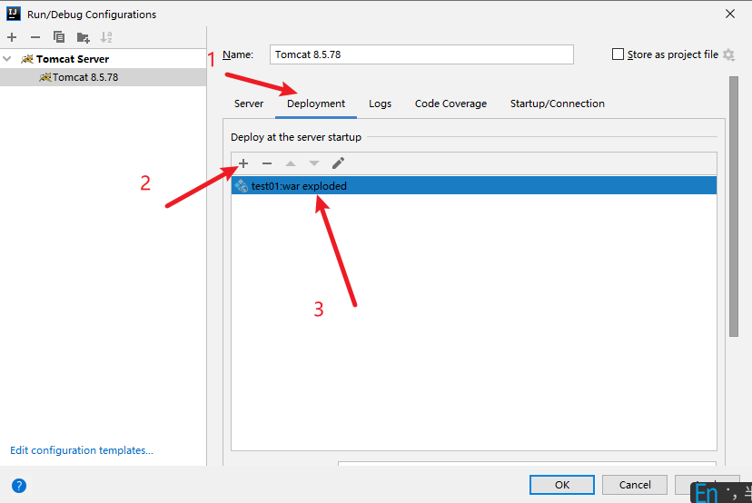

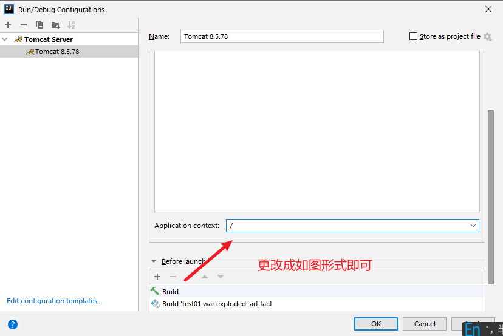

10.配置完成，测试如下：

启动工程：

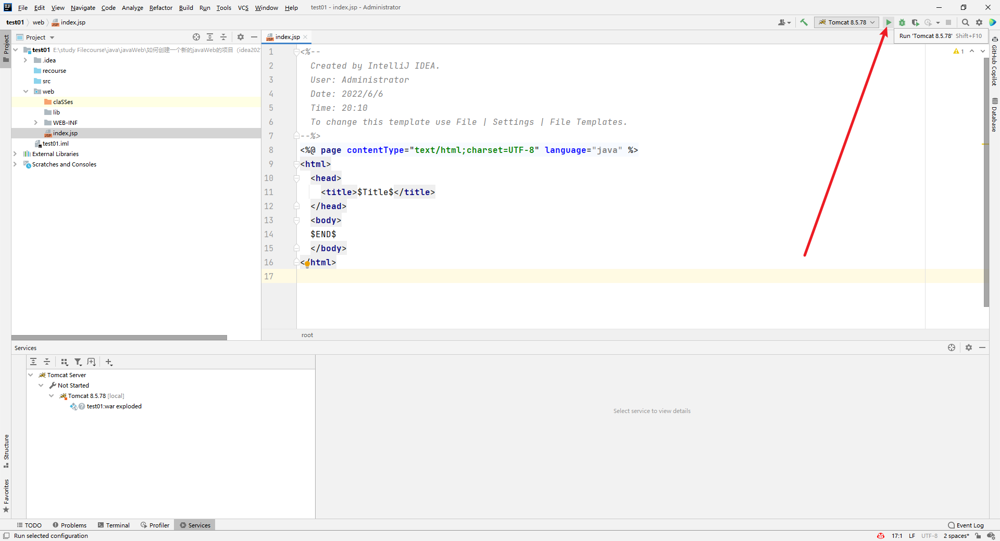

结果如下：

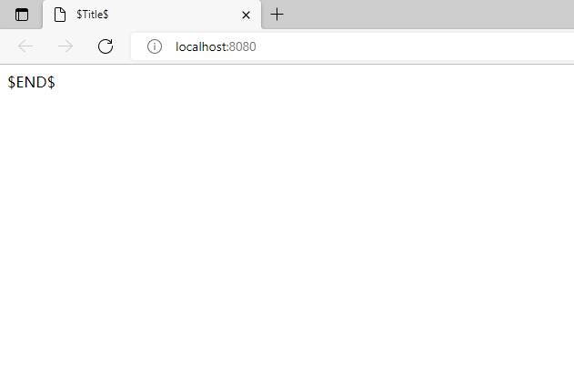

部署成功。

# 初学时，当我们建立多个Moudle时如何配置

前三步骤都是一样的

4.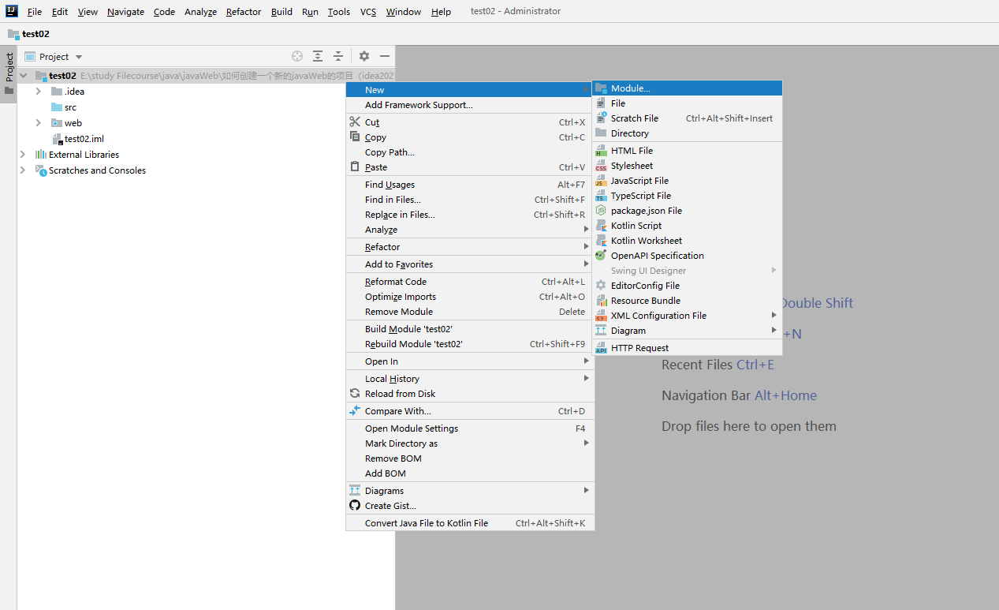

新建一个模块

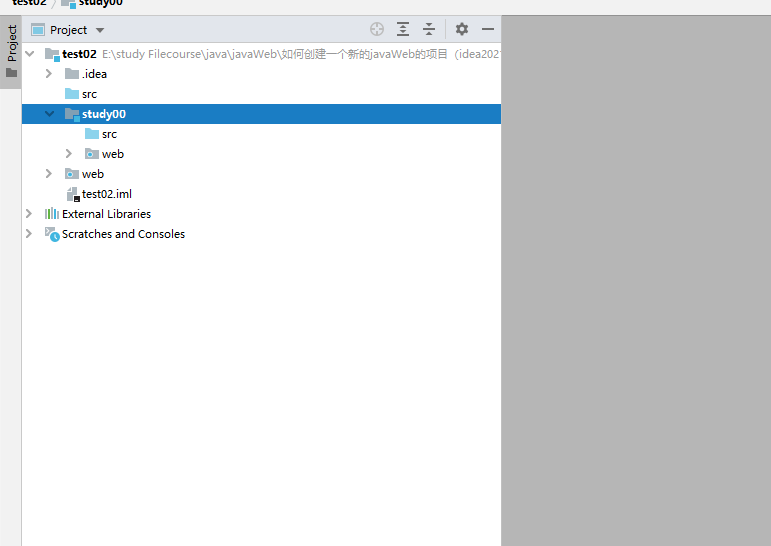

将模块按照前三个步骤布置

我在这里新建了一个类：

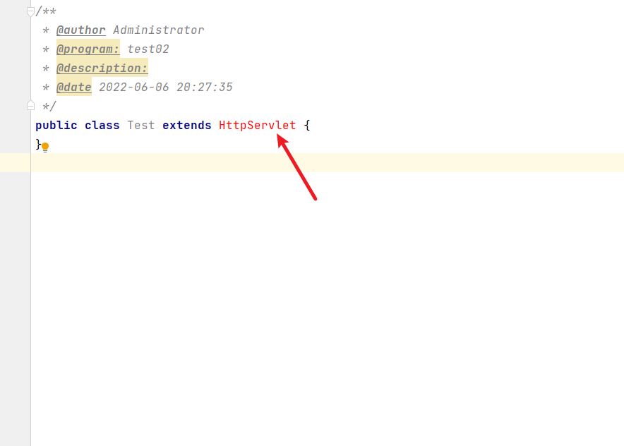

这里报错

如下方法进行修改：

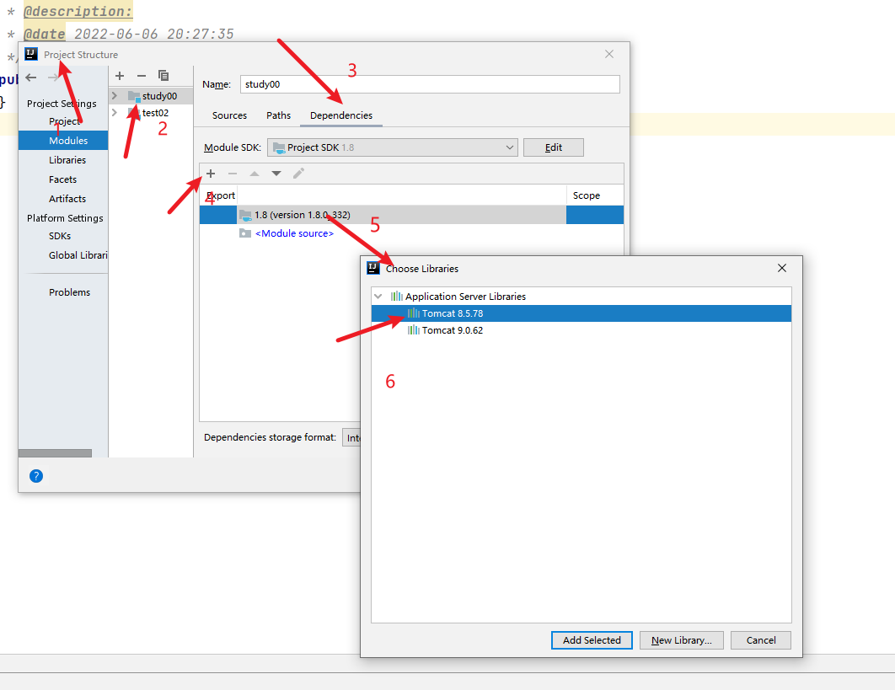

查看External Libraries时就会有Tomcat+version

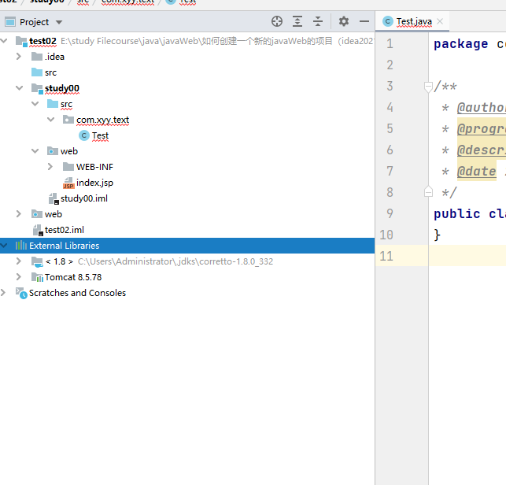

此时报错就消失了，可以继续进行

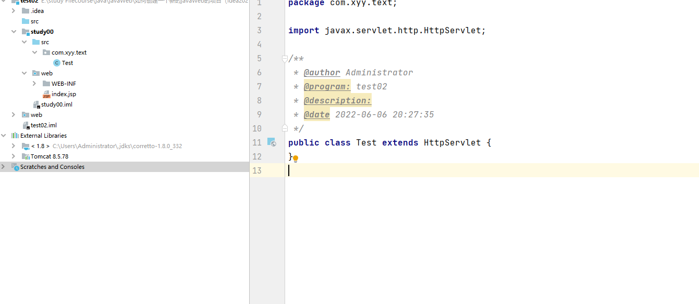